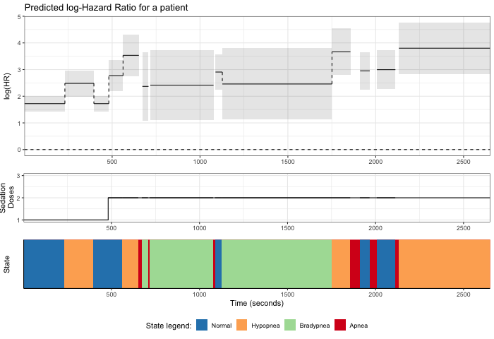

---
---

# Capnography

  

 
<i class="fas fa-procedures fa-10x"></i>

> How a nurse responds to sedation-induced respiratory depression may make the difference between a good or disastrous patient outcome. Deciphering which capnography waveform abnormalities deserve nurses’ attention and intervention from those that do not is an essential step towards successful implementation of this technology into practice for nurse-administered sedation. Dr Conway has an on-going program of research aimed at addressing this goal.

## <i class="fa fa-angle-double-right fa-lg"></i>  A systematic review of capnography for sedation

This [systematic review](https://onlinelibrary.wiley.com/doi/full/10.1111/anae.13378) was published in a highly ranked journal in the field of Anesthesiology and provided the platform for Dr Conway's current research regarding the implementation of capnography monitoring for nurse-administered sedation. 

 

## <i class="fa fa-angle-double-right fa-lg"></i>  Sequence analysis of capnography waveform abnormalities

In this [study](https://awconway.github.io/capnographyssa/) we utilized an approach known as state sequence analysis to examine capnography waveform abnormalities throughout cardiology procedures performed with sedation and analgesia. Analysis of the respiratory state sequences clearly demonstrated that capnography waveform abnormalities are frequent and prolonged in this population of patients undergoing cardiac procedures who received sedation with small bolus doses of midazolam and fentanyl. Applying a clustering algorithm to group similar respiratory state sequences revealed insights into common patterns of ventilatory responses to the medication used for procedural sedation. 

## <i class="fa fa-angle-double-right fa-lg"></i>  Predictors of apnea

To further examine the associations between respiratory states, we used a Mixed effects Cox model, sometimes called a frailty model, to analyze the recurrent apneic events. The plot below illustrates how the risk of an apneic episode varies during the procedure for a patient in the sample. The HR at the beginning of the procedure  is 5.6 [4.2, 7.5] due to the random effect, indicating that this patient is innately at a higher risk for apnea when compared to others in the sample. The increase in HR due to additional sedation doses is apparent during the second episode of normal breathing – upon administration of additional sedative, the HR increases from 5.6 [4.2, 7.5] to 12.0 [7.3, 19.5] and the overall HR remains elevated throughout the rest of the procedure.

