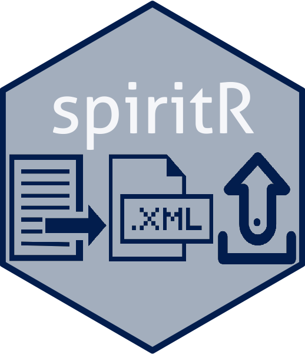
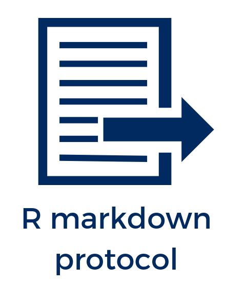
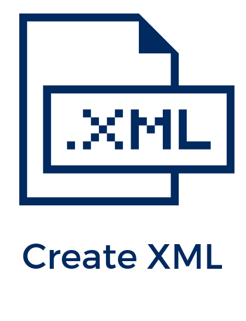

---
output:
  xaringan::moon_reader:
    lib_dir: libs
    css: xaringan-themer.css
    seal: false
    nature:
      highlightStyle: github
      highlightLines: true
      ratio: "16:9"
    includes:
      in_header: fa.html
---

```{r setup, include=FALSE}
options(htmltools.dir.version = FALSE)
library(icon)
library(spiritR)
pathctxmltest <- system.file("extdata", "ctxmltest.xml", package = "spiritR",
                             mustWork = TRUE)
pathaddprtest <- system.file("extdata", "addprtest.xml", package = "spiritR",
                             mustWork = TRUE)
ctxml <- xml2::read_xml(pathctxmltest)
addpr <- xml2::read_xml(pathaddprtest)
```

class: center top hide-count



## A workflow to enable direct upload of a clinical trial protocol to clinicaltrials.gov
<br>

### Aaron Conway
### <i class="fab fa-github-square"></i> [Code](http://github.com/awconway/spiritR) <i class="fad fa-link"></i> [spiritR.netlify.com](https://spiritR.netlify.com) <i class="fab fa-twitter-square"></i> [aw_conway](https://twitter.com/aw_conway)

---
class: left, top hide-count

background-image: url(img/septre.png)
background-size: contain

---
class: left, top hide-count

background-image: url(img/overview_workflow.png)
background-size: contain

---

class: left, top, hide-count

.pull-left[

]

.pull-right[


### <i class="fad fa-book-open"></i> Section for each SPIRIT item 
### <i class="fad fa-link"></i> Links to SPIRIT webpage for guidance
###<i class="fad fa-brackets-curly"></i> Code chunks 
- Enables creation of xml document for upload to clinicaltrials.gov
- Auto-populates fields in relevant sections of clinical trial protocol using in-line code

```{r eval=FALSE}
args_ctxml <- list(
org_name = "UHNToronto",
org_study_id = "Unique ID",
brief_title = "SpiritR test trial",
study_acronym = "N/A", ...)
```

]

---

class: left, top, hide-count

.pull-left[

]
.pull-right[
### Step 1: Create base xml

>Large number of arguments so easiest to use do.call on the list created in the R Markdown template

```{r eval=FALSE}
ctxml <- do.call(spiritR::create_ctxml, args_ctxml)
```

### How it works...
.scroll-output[
`xml2::xml_new_root( "study_collection",
                      "xmlns:prs" = "http://clinicaltrials.gov/prs") %>%
    xml2::xml_add_child("clinical_study") %>% 
    xml2::xml_add_child("id_info") %>% 
    xml2::xml_add_child("org_name", org_name) %>% 
    xml2::xml_add_sibling("org_study_id", org_study_id) %>% ...`
]

]

---

class: left, top, hide-count

.pull-left[

]
.pull-right[
### Step 2: Add to ctxml

>Trials have a different number of arms/interventions and outcomes so required separate functions

```{r eval=FALSE}
ctxml <- add_arm(ctxml, arm_label, arm_type, arm_desc)
ctxml <- add_intervention(ctxml, int_name, int_type,
                          int_desc, arm_label)
ctxml <- add_pr_outcome(ctxml, name, time, description)
ctxml <- add_sec_outcome(ctxml, name, time, description)
ctxml <- add_condition(ctxml, condition)
ctxml <- add_keyword(ctxml, keyword)
```
]

---
class: center, middle, hide-count


.pull-left[
<i class="fad fa-clipboard-list-check fa-10x"></i>
]
.pull-right[
### <i class="fad fa-exclamation"></i> `create_ctxml()` will trigger errors if there are too many characters or not the right format for clinicaltrials.gov xml document

]
---


class: left, top, hide-count

.pull-left[

]

### Step 3: Check ctxml


```{r   eval=FALSE}
print_ctxml(ctxml = ctxml)
```

```{r include=FALSE}
add_arm(ctxml, arm_label = "Standard", 
                               arm_type = "Experimental",
                               arm_desc = "Description for arm")
add_pr_outcome(ctxml = ctxml, name = "test outcome", 
               time = "one week",  
               description = "description")
add_intervention(ctxml, 
                             int_type = "Device", 
                             int_name = "test intervention", 
                             int_desc = "description for intervention", 
                             arm_label = "Intervention")
add_sec_outcome(ctxml, 
                           name = "measure", 
                           time = "timeframe",
                           description = "description")
```

.scroll-output[

```{r echo = FALSE, tx-wrangle, highlight.output = c(79:94, 99:115)}
print_ctxml(ctxml = ctxml)
```
]

---

class: left, top, hide-count

.pull-left[

]
.pull-right[
### Step 4: Upload to clinicaltrials.gov

```{r eval=FALSE}
upload_ctxml(ctxml = ctxml, org_name ="UHNToronto", 
                            user_name = "aconway",
                            password = "password")
```

## Returns a list
 - The ‘content’ element is a list of the messages parsed from the XML response. 
 - The ‘response’ elements is the original XML response.
 ]
 
---

class: center, top, hide-count

.pull-left[

]

<div align="left">

.pull-right[


## Step 5: Check and release


>Even in the event of a successful upload, this function has been programmed with the http POST request 'autoRELEASE' argument set to FALSE. This means that users will need to log-in to clinicaltrials.gov directly to inspect their upload, attend to any warning messages that may have been alerted, and then 'release' the submission for PRS review by clinicaltrials.gov.

</div>
]

---

class: center, middle, hide-count


.pull-left[
<i class="fad fa-wrench fa-10x"></i>
]
.pull-right[
# Future improvements
### R Markdown template currently formatted to knit to html - could add pdf template

### Could add in ability to upload observational/cohort study designs

### Please send <i class="fad fa-bug"></i> reports or issues!

]

---
class: center, middle, hide-count


# Thank you