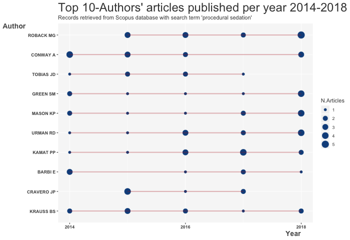

<link rel="stylesheet" href="css/academicons.min.css"/>

 

>Dr. Aaron Conway holds the RBC Chair in Cardiovascular Nursing Research at the Peter Munk Cardiac Centre and is an Assistant Professor in the Lawrence S. Bloomberg Faculty of Nursing at the University of Toronto. His research aims to make procedural sedation and analgesia as *safe* and *effective* as possible. He is a leading researcher in the field of procedural sedation and analgesia having published the second highest number of articles in this highly multi-disciplinary field over the last 5 years.

 

  
Dr. Conway’s current research interests related to procedural sedation includes:

- High flow nasal oxygen;
- Using machine learning to optimise physiological monitoring;
- Temperature monitoring and management;
- Adverse event monitoring to support quality improvement;
- Developing tools and resources to support sedation training and education programs; and
- Using simulation to strengthen the evidence for nurse-administered sedation practice.
  

>Prior to joining Bloomberg Nursing, Dr. Conway was a Senior Research Fellow at the School of Nursing and Institute of Health & Biomedical Innovation, Queensland University of Technology, Australia where he held a National Health and Medical Research Council Early Career Fellowship from 2014-2018.

