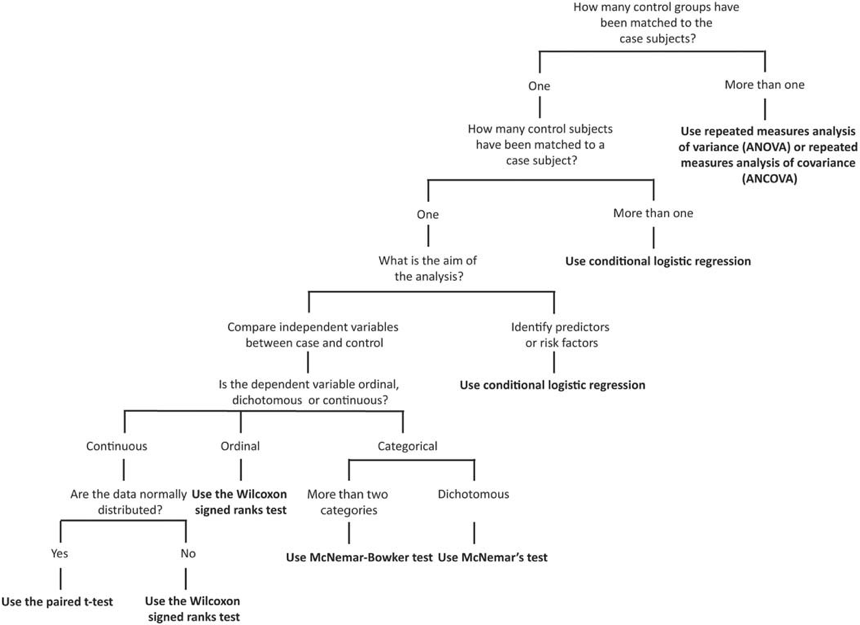

> To optimise the use of evidence in clinical practice, published research needs to be reported with clarity and accuracy. Meta-epidemiology is a type of study focused on evaluating and improving the quality of research. Below are examples of Dr Conway's  meta-epidemiological studies (or methodological analysis). 

 

## <i class="fa fa-angle-double-right fa-lg"></i>  [Quality of evidence in Cochrane systematic reviews](images/High_quality_of_evidence_is_uncommon_in_Cochrane.4.pdf)

 
We identified that authors of many Cochrane systematic reviews made conclusive statements about the effects of interventions based on very low, low and moderate quality evidence. These are important findings considering that there could be negative implications for patient outcomes from concluding that an intervention is superior, inferior or equivalent to an alternative based on evidence that is not high quality.
  

 

## <i class="fa fa-angle-double-right fa-lg"></i> [Statistical analysis of matched case-control studies](https://onlinelibrary.wiley.com/doi/full/10.1002/nur.21536)

 

We sought to ascertain whether matched case–control studies published in the nursing literature utilized appropriate statistical analyses. Of 41 articles identified that met the inclusion criteria, 31 (76%) used an inappropriate statistical test for comparing data derived from case subjects and their matched controls. In response to this finding, we developed an algorithm to support decision‐making regarding statistical tests for matched case–control studies.

