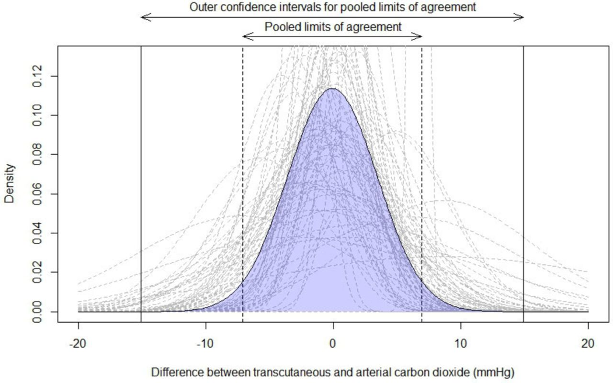

<link rel="stylesheet" href="css/academicons.min.css"/>

  

> It is vital that clinicians have a clear understanding of the accuracy of TcCO~2~ monitoring devices to ensure they are applied in appropriate circumstances. Our research has identified that there are substantial differences between TcCO~2~ and PaCO~2~ depending on the context in which this technology is used. TcCO~2~ sensors should preferentially be applied to the earlobe and users should consider setting the temperature of the sensor higher than 42°C when monitoring at other sites.

  

## <i class="fa fa-angle-double-right fa-lg"></i>  Click [here](https://thorax.bmj.com/content/74/2/157.abstract) for the full systematic review