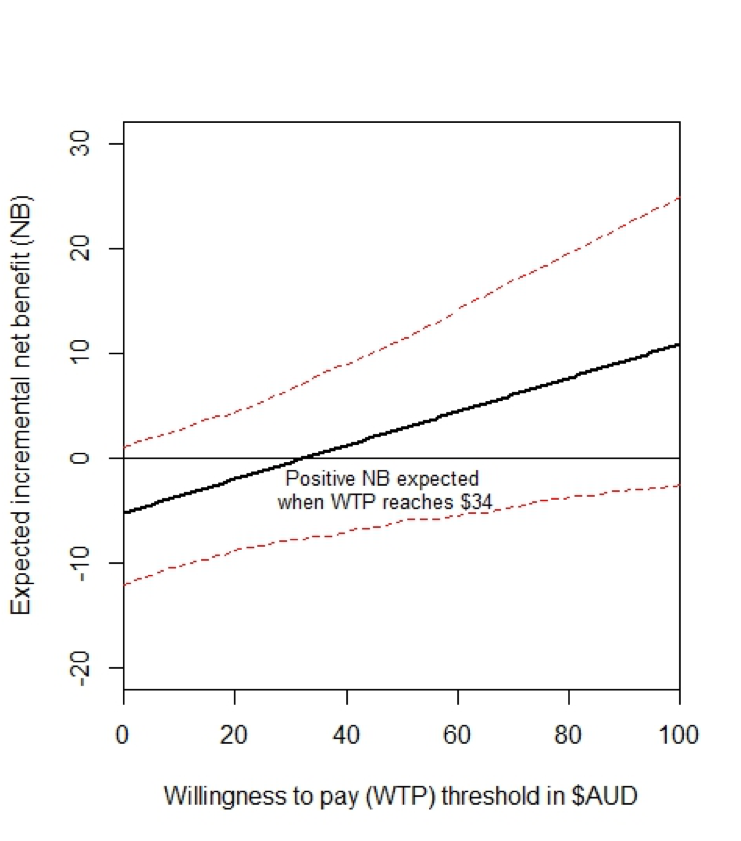

> Mild hypothermia (defined as temperature below 36°C) is considered an adverse effect of anaesthesia that should be avoided. Studies have shown that it increases post-operative complications and reduces patient satisfaction. Patients undergoing procedures in the cath lab are exposed to similar risks for perioperative hypotermia, including a low ambient room temperature and receiving medications that impair thermoregulation. Dr Conway's reearch in this area has revealed several significant findings.

## <i class="fa fa-angle-double-right fa-lg"></i> 1 in every 4 sedated patients were hypothermic (<36.0°C) 

Dr Conway conducted the first prospective [study](https://www.sciencedirect.com/science/article/pii/S1053077015005510) to identify the prevalence of hypothermia after procedures performed with sedation in the cath lab.

  

## <i class="fa fa-angle-double-right fa-lg"></i>  Forced air warming reduced risk of hypothermia by 25%

This [randomized controlled trial](https://heart.bmj.com/content/104/8/685) was published in the highly ranked cardiology journal *Heart*. The results support a change to current thermal management practices in an effort to reduce the incidence of inadvertent hypothermia (which is broadly viewed as an adverse effect of anaesthesia that should be avoided) and improve thermal comfort. 

  

## <i class="fa fa-angle-double-right fa-lg"></i> Forced air warming is cost-effective at a willingness to pay threshold of $34

Alongside the RCT, we conducted a [cost-effectiveness study](https://onlinelibrary.wiley.com/doi/full/10.1111/jan.13707) to determine how much an organization must be willing to pay for the use of forced air warming during sedation in the cath lab to be considered good value. We have also developed an interactive [webpage](https://sedationapps.shinyapps.io/THERMISED/) that decision makers can use to estimate the probability that forced air warming would be cost‐effective at their institution.

