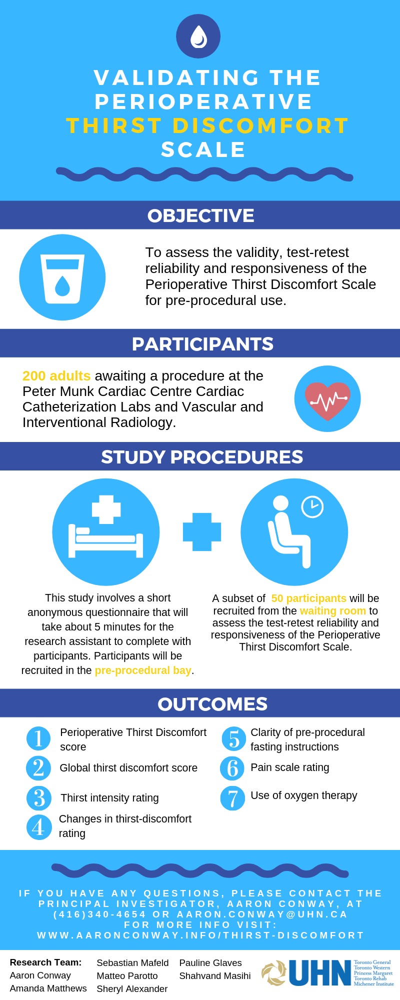

---
---

  

# Validating the perioperative thirst discomfort scale

  
<i class="fad fa-hand-holding-water fa-10x"></i>

> Pre-procedural fasting has been historically implemented to reduce the risk of vomiting and aspiration pneumonia. Prolonged fluid restriction causes thirst symptoms to develop (e.g., dry mouth, swollen tongue), which can lead to great discomfort for the patient. Despite the relevance and value of assessing thirst-discomfort of patients, the subjective experience of thirst presents challenges in developing a valid and reliable tool to succinctly and accurately measure its symptoms and level of discomfort prior to procedures.

 

## <i class="fad fa-search fa-lg"></i>  [View](thirst-discomfort/index.html) the full trial protocol

  

 

